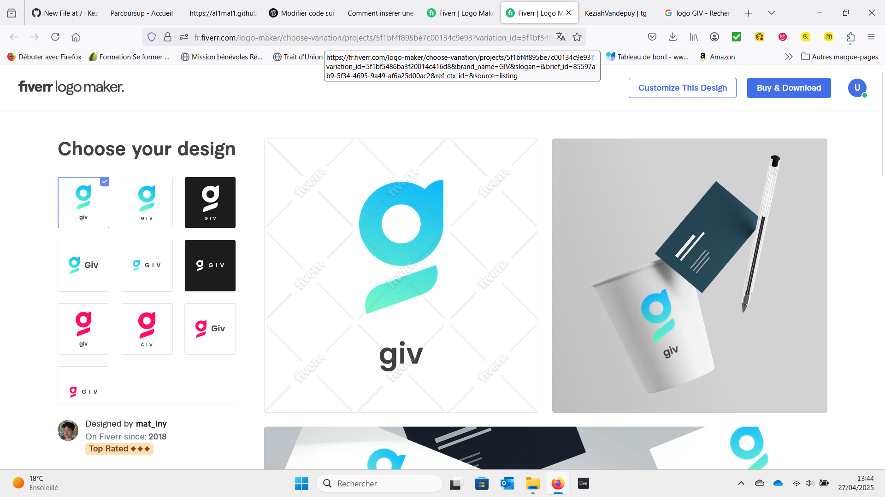

<!DOCTYPE html>
<html lang="en">
<head>
    <meta charset="UTF-8">
    <meta name="viewport" content="width=device-width, initial-scale=1.0">
    <title>GIV Online Store</title>
    
</head>
<body>
    <header>
        
        <nav>
            <ul>
                <li><a href="#clothing-accessories">Clothing & Accessories</a></li>
                <li><a href="#games">Games</a></li>
                <li><a href="#new-arrivals">New Arrivals</a></li>
            </ul>
        </nav>
    </header>

    <main>
        <section id="clothing-accessories">
            <h1>Clothing & Accessories</h1>
            
Discover our trendy collection of clothing and accessories.

        </section>

        <section id="games">
            <h1>Games</h1>
            
Explore our exciting selection of games for all ages.

        </section>

        <section id="new-arrivals">
            <h1>New Arrivals</h1>
            
Stay updated with our latest products and offers.

        </section>
    </main>
</body>
</html>
